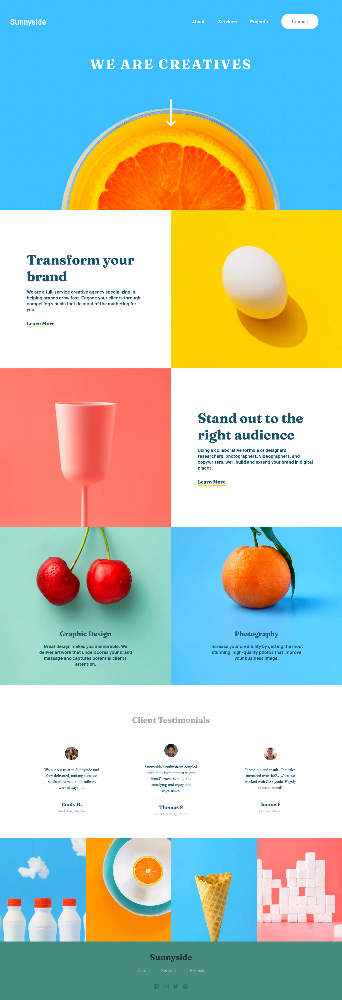

# Frontend Mentor - Sunnyside agency landing page solution

This is a solution to the [Sunnyside agency landing page challenge on Frontend Mentor](https://www.frontendmentor.io/challenges/sunnyside-agency-landing-page-7yVs3B6ef). Frontend Mentor challenges help you improve your coding skills by building realistic projects.

## Table of contents

- [Overview](#overview)
  - [The challenge](#the-challenge)
  - [Screenshot](#screenshot)
  - [Links](#links)
- [My process](#my-process)
  - [Built with](#built-with)
- [Author](#author)

**Note: Delete this note and update the table of contents based on what sections you keep.**

## Overview

### Screenshot

### Links

- Solution URL: [github.com/UsamaKashif/](https://github.com/UsamaKashif/Sunnyside-landing-page/)
- Live Site URL: [sunnyside-landing-page-sigma](https://sunnyside-landing-page-sigma.vercel.app/)

## My process

### Built with

- Semantic HTML5 markup
- CSS custom properties
- Flexbox
- CSS Grid
- Mobile-first workflow
- [React](https://reactjs.org/) - JS library
- [Next.js](https://nextjs.org/) - React framework

## Author

- Website - [Clothgator](https://clothgator.com/)
- Frontend Mentor - [@UsamaKashif](https://www.frontendmentor.io/profile/UsamaKashif)
- Instagram - [@usama_codes](https://www.instagram.com/usama_codes/)

